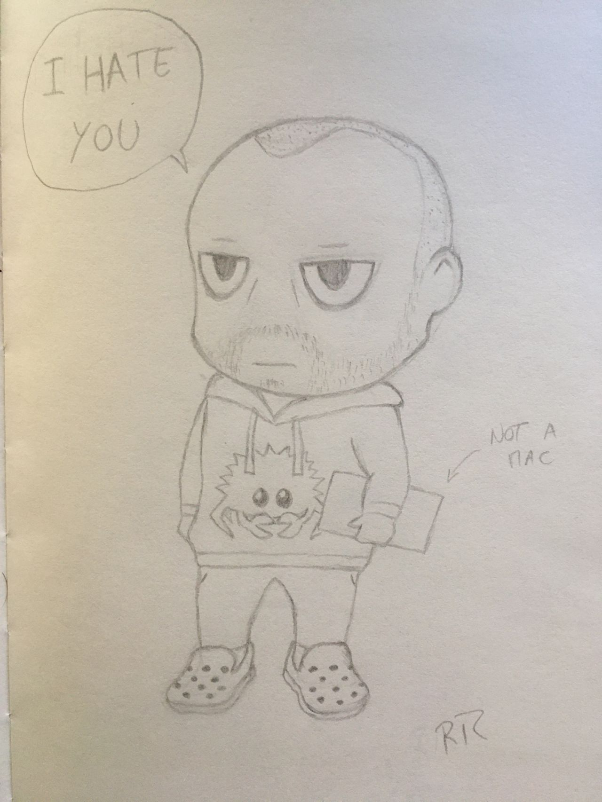

# Principles of Product Engineering

**2020-12-23**

## Preamble

There is an evaluation cycle going on right now, at my present company,
that requires people to write a self-reflection and send it to their manager.
While I firmly disagree with self-appraisals, don't trust the fallacy that you
can evaluate oneself, doing a self-reflection is both important and fruitful.
It's a good way to measure how your behavior and perception have evolved over
time since every self-reflection is a function of these two variables.

I'm moving on to a new challenge on another company so I decided to make
this self-reflection public, this is a good exercise mainly because it forces
me to bring all context when writing any topic, plus the text might be of
relative use to some readers.

Traditionally I would discuss tech-radar topics but I found them to be of
less importance when comparing blocks to a stable and good quality
Product Engineering. 

I finished a three year cycle, mostly as a principal engineer.
I met outstanding people, joined teams, grew teams, was mentor and mentee,
shared a lot of experiences and, in the end, I got this feeling that I was
naive when I joined.

Don't get me wrong, it's not bad, it's actually pretty good, it's a nice way
to measure how much I grew.
At the hiring process I was sold a vision of company which was in need of
strong technical expertise and joined with that in mind, strong tech
expertise was what I wanted to bring to this job when I joined and what I
expected to deliver.

Turns out creating products. technical expertise and delivering value are
quite different things.

## Value

In a past life I worked a year and a half in a very small company, one of
those _[lifestyle
companies](https://en.wikipedia.org/wiki/Lifestyle_business)_, and due to
its small size I got the opportunity of getting really close to processes
such as hiring, sales, customer service and defining company strategy.
These topics are of utmost importance to the majority of companies even
though they frequently are far from the software engineer.

This job was immensely useful since it made me understand very closely how
to run a company, how does the money come in, what's customer churn,
what's employee churn, what are prospects, what's upsell, what's the impact
of a good and a bad hire and, foremost, what's communication.
All of these things simply translate to value.

Value is what an employee can offer an employer, it's also what the employer
is supposed to give to the employee at the end of the month, value.
Salary, bonuses, benefits and any other perks are things that an employee
can get as part of their work, whether these translate to value depends on
the employee.
You may value something in your compensation package but one teammate
might value something else, which is normal.

Personal growth is one such notable example.
Most people find value in personal growth but its value greatly depends
on the employee and the kind of growth an organization offers.
Over the next pages we will find more food for thoughts on this matter.

You probably heard the sentence: any decent answer to an interesting question
begins, ["it 
depends..."](https://twitter.com/KentBeck/status/596007846887628801).
While this prerogative should not be abused, it surfaces the need to
understand context when providing answers, it's not easy to align
everyone's view in the same direction.
Reason being, different entities, people or companies, value things
differently.
As a corolary one may say value depends on need and perception,
how does one perceive value and which needs does one have.

I honestly find this concept extremely easy to understand, my employer is
supposed to give me value, things that I need and care about.
This begs the question, what am I supposed to give back to my employer?
The answer is pretty straightforward, employers want value; but not for
them, they want the employee to produce value for their customers.
This simplifies everything a lot, an employee should not worry about
the employer.
Employees should worry about delivering value directly to the customers.
Be mindful that they're not the company's customers,
they're everyone's customers.

I still get puzzled by the immense literature about this topic.
First there' the [agile
manifesto](https://agilemanifesto.org/principles.html) telling people
to please their customers, then there's a multitude of [lean
publications](https://www.bookdepository.com/search/?searchTerm=lean&ageRangesTotal=9537&category=1897)
which, along with
[agile](https://www.bookdepository.com/search/?searchTerm=agile&ageRangesTotal=17&category=1897),
got into the hype train.
If you read the agile manifesto and lean principles it tells you to deliver
value.
There's an entire new religion with fancy keywords and certifications,
popping up in résumées everywhere, to bring software engineers the word from
the messiah, and the word is, "deliver value".

Apparently it is hard to align everyone with this mindset.

## Alignment

In the world of large companies people grew and became dedicated,
specialized, tech-savvy, used to their surroundings.
In these large companies, while leadership was aware of what the company
wanted to deliver to customers it became harder for the ones
producing this value to see the exact same picture.
This is a problem of alignment, while everyone wears the same team sweater
people are walking in different directions, seldom the direction the company
wants to move in.
It's great that [some people](https://agilemanifesto.org/)
focused on surfacing, to the software engineering world, that there are some
things being forgotten or neglected and one such thing is lack of alignment.

Lack of alignment causes meetings to take infinite time, emails to be dense and
confusing, and makes people want to take refuge behind documentation
and processes.
To speak a message is easy, to be sure the listener understood the exact same
message is an endeavour proportional to how far the speaker is from the listener
within the organization.
Context is key here, the closer the people are, the more context they share,
people too distant in the organization share little to no context.

Tribes begin to surge and the mindset of _[Us vs
Them](https://www.theemotionmachine.com/the-us-vs-them-mentality-how-group-thinking-can-irrationally-divide-us/)_ 
spawns naturally.
As a simple example, [not invented
here](https://en.wikipedia.org/wiki/Not_invented_here) is a common
form of tribalism.
One simple form which shows that group dynamics happen at the core of every
company.
Taking a brief look at sociology and group psychology topics:
- [Intergroup
Dynamics](https://en.wikipedia.org/wiki/Group_dynamics#Intergroup_dynamics)
studies how one can dwell and better understand how large organizations
act, in fact as groups of groups.
- [Types of
Groups](https://en.wikipedia.org/wiki/Group_dynamics#Types_of_groups)
show a little bit of how humans have clear group priorities,
another item to add to the context that any person carries.
- [Dunbar's number](https://en.wikipedia.org/wiki/Dunbar%27s_number)
discusses a bit the size of the connection sphere a person can keep.

Even without studying sociology or group psychology it's simple to see
that behavioral patterns in companies are recurrent and seldom change.
Nothing is new here, mostly everyone knows empirically that there is a
majorant to the group size of people we can sustain stable relations with
(Dunbar) and that everyone has a background and values one's
previous learnings and context (types of groups).

In all cases creating alignment comes down to communicating in a way that is
effective and overcomes the hurdles posed by the intergroup dynamics.
Communicating the best possible message, providing context, eliminating the
possibility of cognitive biases.

Alignment is also a topic inside each group.
- [Ingroup
dynamics](https://en.wikipedia.org/wiki/Group_dynamics#Intragroup_dynamics)
studies a wide range of theories.
- [Status and
Expectations](https://en.wikipedia.org/wiki/Expectation_states_theory)
also provide vital roles in shaping groups and ingroup behaviors, this
bears the notion that humans have state, we are state machines.
- [Investing and expecting
return](https://en.wikipedia.org/wiki/Social_exchange_theory)
from relations is another topic which is both easy to understand
but hard to manage.
- [Groupthink](https://en.wikipedia.org/wiki/Groupthink) shows that
the spheres pertain specific behaviors such as:
    - [Asch's conformity
experiment](https://en.wikipedia.org/wiki/Asch_conformity_experiments) details
how we act differently when in groups.
    - [Milgram
experiment](https://en.wikipedia.org/wiki/Milgram_experiment) surfaces
how one can choose authority over conscience sometimes

Alignment, even with great communication, is super hard to get.
While handling with groups of groups, delivering value with a large company
is much harder than perceived.

## Groups

Why do we need agile coaches, then? We wouldn't need them if we could keep
focusing on something else outside our sphere of concern but since Dunbar
said that that sphere has a bounded size, we're getting [cognitive
biases](https://en.wikipedia.org/wiki/Cognitive_bias#Types) on most
of our work.
There is a limited amount of things we can constantly think about plus we
favor our group over other people or groups.

Going back in time we can see solutions to this problem, how to keep groups
aligned, one such solution was [divide and
rule](https://en.wikipedia.org/wiki/Divide_and_rule).
While devious in purpose, this technique used an outstanding way of solving
the alignment problem, it moved the problem to smaller spheres, in
manageable group sizes alignment is easier to maintain.
Solving a problem is a goal clear enough and the ruler or any sphere had
the autonomy to achieve the goal as they would believe it was best.

With a large mediatic footprint, spotify did 
[two](https://engineering.atspotify.com/2014/03/27/spotify-engineering-culture-part-1/)
[parts](https://engineering.atspotify.com/2014/09/20/spotify-engineering-culture-part-2/)
on how they planned or achieved to address this.
There's a lot of controversy on whether spotify actually does this and
whether these models do work, that is not relevant, the bottom line is that
in order to achieve a major goal at scale, split that into smaller
independent goals and give them to smaller independent groups.
When the group size is manageable by all the sociology and group psychology
limitations alive today, the group will have no alignment issues.
With a common goal we can even make use of group dynamics and make it
perform and deliver much better than in any other format.

The major caveat in the plan sketched above is that you cannot run a command-and-control structure. If you do, you'd be sharing expectations of things to happen instead of goals. The difference, if looking subtle, is a game changer.
[Product teams vs feature
teams](https://svpg.com/product-vs-feature-teams/) is something I've
seldom seen properly applied.
I cannot stress enough how this must be done right and the vision of
product teams must be implemented without shortcuts, alternatives result
in major misalignment between company stakeholders and customers,
all caused by the wrong product being created and possibly delivered.
The end result is: waste of time and money; more specifically, time to market
lost and money wasted on doing the wrong thing.

Apart from the intergroup issues outlined above there are ingroup problems
found in several teams.
Some were born from selective reading of the [principles
inherent](https://agilemanifesto.org/principles.html) to the agile manifesto.
Sentences like _"build projects around motivated individuals"_, _"continuous
attention to technical excellence and good design enhances agility"_ and
_"the best architectures, requirements, and designs emerge from
self-organizing teams"_ have tricked people's minds.
People naturally value their group more than outside people or groups and
fall into a cognitive bias where they see their group as better than other
groups.

This tunnel vision stemming from ingroup psychology leads to [reading known 
patterns](https://en.wikipedia.org/wiki/Pareidolia) from unknown data.
Taking the quotes above from the agile manifesto principles it's [possible
to misread](https://en.wikipedia.org/wiki/Rorschach_test) that
_"teams own architecture, they must be made of motivated 
individuals and they must keep focus to technical excellence and good design"_
in order to achieve the agile panacea.
This ends in [analysis
paralysis](https://en.wikipedia.org/wiki/Analysis_paralysis),
[overengineering](https://en.wikipedia.org/wiki/Perfect_is_the_enemy_of_good)
and, lastly, moving in the direction not intended by the company itself.
This rogue line of action is how good groups get defiled from within.

Teams have a reduced vision of the world, that's the reason they're so
productive, they have a specific scope. Apple, Gitlab and others has been
known to battle overengineering and poor communication with techniques mainly
[placing a single person 
responsible](https://about.gitlab.com/handbook/people-group/directly-responsible-individuals/)
for a certain topic in order to guarantee delivery.
It's easier for a single person in the spotlight to get things going
than for an [entire group to be formally
responsible](http://www.columbia.edu/~sss31/rainbow/whose.job.html).
In sum this eliminates communication issues and keeps focus on value delivered,
since there is no group decision thus no quorum required to get a final answer.

By delivering a clear and bite-sized goal to a team delivering value
can be truly multiplied.

## Delivery

Up until now we've covered issues from the understanding that value is the
one thing that matters, to issues with alignment, to challenges caused by
group behavior.
How hard is it to organize for consistent and quality delivery with a
large organization?
Do we need to copy spotify? Copy netflix? Which path to take?

U.S., 1960s.
Ken Iverson [drew a
strategy](https://en.wikipedia.org/wiki/F._Kenneth_Iverson#Management_philosophy)
to make this happen.
He became chairman of a company about to go bankrupt and he brought
the company to the top.
He made the company as [light as
possible](https://fs.blog/2016/10/iverson-cure-for-the-common-mba/),
made people connect with [value
delivered](https://fs.blog/2016/02/ken-iverson-incentive-systems/) but
most of all [everything was
decentralized](https://fs.blog/2016/01/ken-iverson-nucor/).
It's a total representation of what agility aims to be, people focused on
delivering value with a feedback cycle on that delivery, decentralization
allowing people to be focused on goals instead of orders, teams finding
their own way for delivering value.

You don't need to copy spotify, netflix, nucor or anyone else, in fact
you should never copy blindly but learn by weighing pros and cons.
Remember that if you're deciding roadmap top-down then you're
using command-and-control and [you're doing
waterfall](https://svpg.com/revenge-of-the-pmo/).
Teams should have ideal size, be cross-functional and be completely
independent.
Not just engineers, product owners, managers, everyone required to deliver
value should be on a team.
Leadership should be good enough in order to decide goals so that teams can
dedicate time in finding the way to achieve them.
Product must be decided, designed, done and measured at the team level.
Finally, alignment is communication, not agreement.
Think mini-companies where each team is a company.

The glue?
[Short but strong guidelines](https://youtu.be/PzEox3szeRc?t=1640) where
Everyone can go and understand what the contracts are.
Finally, measuring value should not only be done at team level but also
passed bottom-up so that leadership can act in the case of mismatches,
in sum, pass information but give context as much as possible.

## Context

In my self-reflection I had to bring up a lot of context which I tried to
summarize over the last handful of pages.
One of the key findings I did over these years is that software engineers
are on the best spot to [understand these
issues](https://twitter.com/backslashx1b/status/1299604272489934849) with
ease, I'll risk and say that it's in fact natural!

Today, topics such as microservices, distributed systems,
scaling stateless systems, application orchestrators, metrics and alarms
are quite common topics in production environments.
All of these map to at least one of the issues which we see daily in
product engineering at scale.
Scaling problems are the same and software engineers are used to solve them.
There are known patterns, papers, blog posts, books, meetups and full-fledged
talks and conferences about these topics, software engineers must make
use of all of this tech material and start handling the scalability
concerns in organizations as they do in system design.

## SLIs and SLOs

Some of us [have read](https://sre.google/sre-book/service-level-objectives/),
praised and shared the notions of the SLI and SLO.
Software engineers know how to do metrics and monitoring but not
everyone measures business metrics.
This is the core of SLIs, find a measure which is the best indicator of the
level your service is providing.
That has been brought up some pages ago, it's **value**.

In order to make value tangible, the organization must look at it as
something every team can watch and drive, it's the only thing
that teams need to create and that the customer wants or needs.
By measuring it, the team will be able to run in continuous mode, since
there's a gauge for the quality of delivery, and will be able as well
as provide a concise line of information to leadership reporting how the
team's work is doing.
Plus, by having an SLI, a team will never again be disconnected from the
value that it needs to deliver, overengineering, [imaginary 
needs](https://www.joelonsoftware.com/2001/04/21/dont-let-architecture-astronauts-scare-you/)
and analysis paralysis should disperse.
In fact it's not much different from TDD either, walk towards a
well-defined, shared and understood goal.

Engineers know exactly how to do this, there is no reason to believe that
the notion of delivering value is hard to grasp.
By using SLIs, an organization is able to place, both at the leadership
and at the team level, KPIs to properly measure value delivered.

## State, Causality and Convergence

Alignment concerns doing communication in a way that all desired groups
or people get to a common understanding or in plain terms, get everyone
to look at the same picture.
In software engineering alignment is handled in multiple ways.
As previously discussed, lack of alignment falls down frequently to
inappropriate communication which frequently compromises lack of context.
Let's approach this using _state_, _causality_ and _convergence_.

Context is, in the software engineering world, state.
Stateless applications are the easiest to deal with, no context must be kept
between executions.
Much like pure functions, only the variables passed to the function are
required to calculate the result.

To most software engineers that's a concept dealt with on a daily basis.
Every software engineer knows how HTTP is stateless.
The word "stateless" here is a misnomer, the HTTP protocol requires
no state on the server but the request has to carry the entire state
for the request.
In order for some specific business logic to happen a rich request has
to be performed containing complete _context_ so that the server does
what we expect of it.
The trick of sending state in requests is not new, the way of giving full
context when communicating should be used as much as stateless protocols
are used and trusted.

It's common to have assumptions when communicating, it should be also
common to send those assumptions with the communication itself.
That's the principle of [version
vectors](https://en.wikipedia.org/wiki/Version_vector).
Holding and passing information is legitimate, stating the state, or
_context_, the sender had when the information was written is crucial.
This way causal context is always present and the receiver of the message
has the possibility of resolving any conflict.
It's ok to assume and communicate on top of those assumptions, it's
mandatory, however, so state those assumptions openly with the
communication.
Understanding the way to go must be decided to the listener.
I've seen this pattern benefiting most in cross-teams communication,
where tribalism such as not-invented-here is more bound to happen.

Passing an order is different from passing intent.
Software engineers know the difference between [events and
commands](https://martinfowler.com/eaaDev/EventNarrative.html#EventsAndCommands).
Reporting something is decoupled from the actions of systems consuming the
message.
Analogously, a goal communicated in a product-team organization must have
similar effect.
Leadership will guarantee that the message holds full context on the goal
to achieve, but the reaction from the team itself should be decided
autonomously by the team, regarding current state, _context_, and SLI, _value_.

This is not new, CRDTs  work this way.
(In here I'm talking about CvRDTs only.)
Assume all state held by people is a CRDT.
When leadership replicates something to teams it will eventually converge.
However the [convergence
moment](https://lars.hupel.info/topics/crdt/04-combinators/#grow-only-counters-revisited)
and the final result is unknown to the sender because they depend on the
CRDT representing the team and other replication flows.

Teams have more than one incentive which causes them to change state,
priorities, context, pick your term.
[Since the network is
unreliable](https://martin.kleppmann.com/2015/05/11/please-stop-calling-databases-cp-or-ap.html),
prioritize communication and define well what's the decision method.
They must have the autonomy to apply causality and convergence rules by
themselves.

## Domain Driven Design

Group dynamics is an extensive topic.
One of the things I've seen hurting companies is trying to fight
[Conway's law](https://en.wikipedia.org/wiki/Conway%27s_law).
It's only natural that systems mimic the organization producing and
maintaining them: aligning the groups who do the actual work is hard,
always passing state is tiring, dealing with causality is a time-killer,
convergence is eventually consistent.
While we did find ways to communicate properly it should be kept to a logical
minimum.
Some companies found [the ideal team
size](https://duckduckgo.com/?q=ideal+team+size+agile) (pick any result)
which means that the size of a group where communication has implicit state
has an ideal range of values.

Again, this is simple to understand for software engineers:
Micro-services and Domain Driven Design are the bread-and-butter
of today's system design.
Monoliths are considered evil but [nano-services are
atrocities](https://martinfowler.com/bliki/AnemicDomainModel.html).
Designing services too small leads to a disparity between
business domain and services provided and creates an enormous burden
on communication between services.
Notable analogy, it's empirically known that picking up a team and giving
a [task to each
member](https://en.wikipedia.org/wiki/Micromanagement) and hope
it all connects in the end is bad for speed and causes major
disruption at the end.
This should be noted and moved to the organization level, teams
should have a stable and good size.
That helps out with stable work relationships, keeps a healthy number
of people on the same business context and allows for a cross-functional
boosting plurality and inclusion too.

## Final State

These years of experience turned out to be more fun than I thought.
I've worked in several companies with different sizes and behaviors
and although I usually rant about technologies, when looking back,
I only see opportunities to improve.
These opportunities come mostly from designing organizations.
Fun fact, they are distributed systems just like the ones everyone
knows, plus, the same techniques can be applied.

I've found that _good principles_, along with a good technology knowledge,
will make you benefit the most.
I've been asked about the _principal engineer_ role, my answer today is:
_aim to be a principled engineer, that will make you a much stronger
member of an organization and a far more valuable person_.

---

_A caricature of me by [Rafael T.
Rocha](https://www.linkedin.com/in/rafael-teles-rocha/)_
